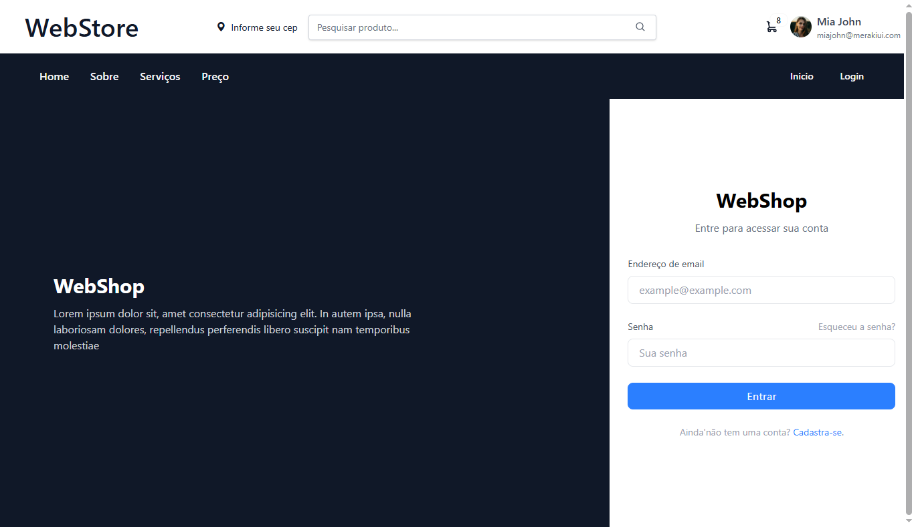
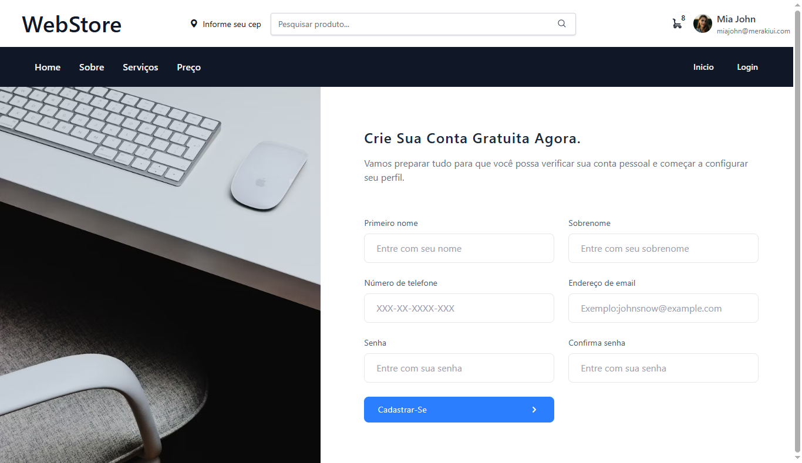

<h1>🛍️ WebStore - Plataforma de E-commerce PHP</h1>

<p align="left">
  <a href="#"></a>
  <a href="#"></a>
  <a href="#"></a>
  <a href="#"></a>
  <a href="#"></a>
</p>

<br>

## 🖼️ Layout do Projeto

### 🔐 Tela de Login


### 📝 Tela de Cadastro


### 🏠 Página Inicial (Produtos)


---

## 📄 Descrição

> **WebStore** é uma plataforma de e-commerce desenvolvida com PHP e SQLite, ideal para pequenas e médias lojas online.  
> O sistema oferece funcionalidades completas como cadastro de produtos, gerenciamento de usuários, carrinho de compras, finalização de pedidos e um painel administrativo intuitivo.  
>
> Com uma interface responsiva construída com TailwindCSS e ícones do Bootstrap Icons, o projeto busca aliar desempenho, simplicidade e escalabilidade — sendo uma ótima base para estudos ou projetos reais na área de desenvolvimento web.

---

## 🚀 Funcionalidades

- **Cadastro e login de usuários** — Sistema seguro para registrar e autenticar clientes.
- **Listagem de produtos** — Exibição organizada dos produtos disponíveis para venda.
- **Carrinho de compras** — Permite aos usuários adicionar produtos e gerenciar suas compras.
- **Finalização de pedidos** — Processo completo para o fechamento e confirmação de compras.
- **Área do administrador** — Painel exclusivo para gestão do sistema e controle de vendas.
- **Cadastro de produtos e categorias** — Ferramentas para gerenciar o catálogo de produtos.
- **Upload de imagens** — Suporte para inclusão de imagens dos produtos.
- **Painel de pedidos** — Visualização e gerenciamento dos pedidos realizados.


<br>

## 🛠️ Tecnologias Utilizadas

### 🔙 Back-End
- PHP 8

### 🗄️ Banco de Dados
- SQLite
- MySQL

### 🎨 Front-End
- HTML5, CSS3, JavaScript
- TailwindCSS
- Bootstrap Icons

### 🧰 Ferramentas e Versionamento
- Git
- GitHub


---

## 📦 Como executar o projeto

```bash
# Clone o repositório
git clone https://github.com/Micael-William/web-store.git

# Acesse a pasta do projeto
cd web-store

# Inicie o servidor embutido do PHP
php -S localhost:8000 -t src/

# Depois disso, abra seu navegador e acesse:
http://localhost:8000
```
>⚠️ Certifique-se de que o PHP está instalado e disponível no terminal.
>
>💡 Caso utilize XAMPP, Wamp ou Laragon, mova a pasta para o diretório htdocs ou www e acesse via navegador.
<br>


## 👤 Autor
>Micael William<br>
Github https://github.com/Micael-William
